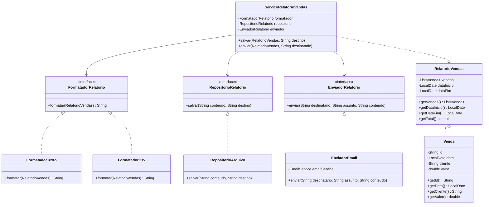

# Exercício 1 — Single Responsibility Principle (SRP)

## 1. Por que a classe `RelatorioVendas` viola o SRP

O SRP diz que uma classe deve ter **uma única razão para mudar**, ou seja, deve responder a
um único ator/motivo de negócio.

A classe `RelatorioVendas` mistura, no mesmo arquivo, decisões que pertencem a mundos
completamente diferentes:

- **regra/estrutura de dados do relatório** (quais vendas, qual período, qual total);
- **formatação de apresentação** (o texto, os rótulos, o `String.format("%.2f", ...)`, as quebras de linha);
- **persistência em disco** (`FileWriter`, tratamento de `IOException`, caminho do arquivo);
- **envio por e-mail** (instancia `EmailService` com `new`, define assunto e destinatário);
- **o modelo de domínio `Venda`**, declarado como classe interna dentro do relatório.

Consequência prática: a classe muda se o setor comercial pedir um novo campo no relatório,
muda se o time de infraestrutura trocar a gravação de arquivo local por S3, muda se o
formato virar CSV/PDF/HTML, e muda se o provedor de e-mail for trocado. São **quatro atores
diferentes** capazes de forçar alteração no mesmo código — exatamente o que o SRP proíbe.

Efeitos colaterais dessa concentração:

- **Baixa testabilidade**: não é possível testar a geração do texto sem arrastar junto
  `FileWriter` e `EmailService` (e este último é instanciado internamente, então não dá para
  substituir por um dublê de teste).
- **Baixo reúso**: se outro relatório (por exemplo, `RelatorioEstoque`) precisar salvar em
  arquivo ou enviar por e-mail, o código será duplicado.
- **Alto acoplamento**: a regra de negócio depende diretamente de detalhes de I/O.

## 2. Responsabilidades assumidas (pelo menos três)

| # | Responsabilidade | Razão de mudança / ator |
|---|------------------|-------------------------|
| 1 | Agregar e calcular os dados do relatório (filtro por período, soma do total) | Regra de negócio / setor comercial |
| 2 | Formatar o relatório como texto | Time de produto / requisitos de apresentação (texto → CSV → PDF) |
| 3 | Persistir o relatório em arquivo | Infraestrutura (disco local → S3 → banco) |
| 4 | Enviar o relatório por e-mail | Infraestrutura de comunicação (SMTP → API de terceiros) |
| 5 | Definir o modelo de domínio `Venda` | Modelagem do domínio |

## 3. Nova estrutura de classes proposta

### Diagrama de classes



### Papel de cada classe

- **`Venda`** — entidade de domínio, agora independente (arquivo próprio), reutilizável por
  qualquer outro contexto.
- **`RelatorioVendas`** — apenas os **dados** do relatório (período, lista de vendas) e o
  cálculo do total. Não sabe formatar, salvar nem enviar.
- **`FormatadorRelatorio`** — abstração de formatação. Adicionar CSV, HTML ou PDF é criar
  uma nova implementação, sem tocar nas demais classes (também atende ao OCP).
- **`RepositorioRelatorio`** — abstração de persistência. `RepositorioArquivo` guarda a
  lógica de `FileWriter`; amanhã pode existir `RepositorioS3`.
- **`EnviadorRelatorio`** — abstração de envio; `EnviadorEmail` encapsula o `EmailService`,
  que agora é **recebido** por construtor em vez de instanciado com `new` (também atende ao DIP).
- **`ServicoRelatorioVendas`** — orquestrador fino: pega o relatório, pede a formatação e
  delega ao repositório ou ao enviador. Ele coordena, não executa detalhes.

### Código de referência

```java
// Venda.java
public class Venda {
    private final String id;
    private final LocalDate data;
    private final String cliente;
    private final double valor;

    public Venda(String id, LocalDate data, String cliente, double valor) {
        this.id = id;
        this.data = data;
        this.cliente = cliente;
        this.valor = valor;
    }

    public String getId() { return id; }
    public LocalDate getData() { return data; }
    public String getCliente() { return cliente; }
    public double getValor() { return valor; }
}

// RelatorioVendas.java — apenas dados e cálculo
public class RelatorioVendas {
    private final List<Venda> vendas;
    private final LocalDate dataInicio;
    private final LocalDate dataFim;

    public RelatorioVendas(List<Venda> vendas, LocalDate dataInicio, LocalDate dataFim) {
        this.vendas = List.copyOf(vendas);
        this.dataInicio = dataInicio;
        this.dataFim = dataFim;
    }

    public List<Venda> getVendas() { return vendas; }
    public LocalDate getDataInicio() { return dataInicio; }
    public LocalDate getDataFim() { return dataFim; }

    public double getTotal() {
        return vendas.stream().mapToDouble(Venda::getValor).sum();
    }
}

// FormatadorRelatorio.java
public interface FormatadorRelatorio {
    String formatar(RelatorioVendas relatorio);
}

// FormatadorTexto.java
public class FormatadorTexto implements FormatadorRelatorio {
    @Override
    public String formatar(RelatorioVendas relatorio) {
        StringBuilder sb = new StringBuilder();
        sb.append("Relatório de Vendas\n");
        sb.append("Período: ").append(relatorio.getDataInicio())
          .append(" até ").append(relatorio.getDataFim()).append("\n\n");

        for (Venda venda : relatorio.getVendas()) {
            sb.append("ID: ").append(venda.getId())
              .append(" | Data: ").append(venda.getData())
              .append(" | Cliente: ").append(venda.getCliente())
              .append(" | Valor: R$ ").append(String.format("%.2f", venda.getValor()))
              .append("\n");
        }

        sb.append("\nTotal de vendas: R$ ")
          .append(String.format("%.2f", relatorio.getTotal())).append("\n");
        return sb.toString();
    }
}

// RepositorioRelatorio.java
public interface RepositorioRelatorio {
    void salvar(String conteudo, String destino);
}

// RepositorioArquivo.java
public class RepositorioArquivo implements RepositorioRelatorio {
    @Override
    public void salvar(String conteudo, String caminho) {
        try (FileWriter writer = new FileWriter(caminho)) {
            writer.write(conteudo);
        } catch (IOException e) {
            throw new RuntimeException("Erro ao salvar relatório em arquivo: " + caminho, e);
        }
    }
}

// EnviadorRelatorio.java
public interface EnviadorRelatorio {
    void enviar(String destinatario, String assunto, String conteudo);
}

// EnviadorEmail.java
public class EnviadorEmail implements EnviadorRelatorio {
    private final EmailService emailService;

    public EnviadorEmail(EmailService emailService) {   // injeção — DIP
        this.emailService = emailService;
    }

    @Override
    public void enviar(String destinatario, String assunto, String conteudo) {
        emailService.enviarEmail(destinatario, assunto, conteudo);
    }
}

// ServicoRelatorioVendas.java — orquestração
public class ServicoRelatorioVendas {
    private final FormatadorRelatorio formatador;
    private final RepositorioRelatorio repositorio;
    private final EnviadorRelatorio enviador;

    public ServicoRelatorioVendas(FormatadorRelatorio formatador,
                                  RepositorioRelatorio repositorio,
                                  EnviadorRelatorio enviador) {
        this.formatador = formatador;
        this.repositorio = repositorio;
        this.enviador = enviador;
    }

    public void salvar(RelatorioVendas relatorio, String destino) {
        repositorio.salvar(formatador.formatar(relatorio), destino);
    }

    public void enviar(RelatorioVendas relatorio, String destinatario) {
        enviador.enviar(destinatario, "Relatório de Vendas", formatador.formatar(relatorio));
    }
}
```

### Ganhos obtidos

- Cada classe tem **uma única razão para mudar**.
- Trocar o formato do relatório não recompila a lógica de e-mail nem a de arquivo.
- É possível testar `FormatadorTexto` isoladamente, e testar `ServicoRelatorioVendas` com
  dublês (`fake`/`mock`) das três abstrações — sem tocar em disco nem enviar e-mail de verdade.
