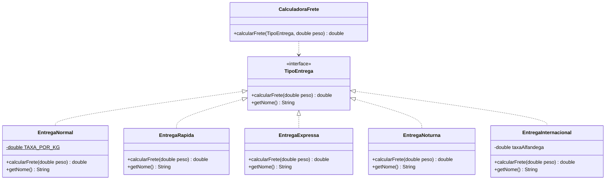

# Exercício 2 — Open/Closed Principle (OCP)

## 1. Problemas do código atual em relação ao OCP

O OCP diz que uma classe deve estar **aberta para extensão e fechada para modificação**:
adicionar comportamento novo não deveria exigir editar código já escrito, testado e em produção.

A `CalculadoraFrete` original viola isso de forma direta:

```java
public double calcularFrete(String tipoEntrega, double peso) {
    switch (tipoEntrega) {
        case "Normal":   return peso * 5.0;
        case "Rápida":   return peso * 10.0;
        case "Expressa": return peso * 20.0;
        default: throw new IllegalArgumentException("Tipo de entrega desconhecido: " + tipoEntrega);
    }
}
```

Problemas concretos:

1. **Fechada para extensão, aberta para modificação** — cada novo tipo (Noturna,
   Internacional) obriga a abrir a classe e acrescentar um `case`. Isso é exatamente o
   inverso do que o OCP pede.
2. **Risco de regressão** — mexer no `switch` reabre o risco de quebrar os tipos que já
   funcionavam; todos os testes da classe precisam ser reexecutados a cada novo tipo.
3. **`switch` que tende a se espalhar** — na prática esse mesmo `switch` acaba duplicado em
   outros pontos (prazo de entrega, rótulo na tela, regras de seguro), e é fácil esquecer de
   atualizar um deles.
4. **Tipo representado por `String`** — não há validação em tempo de compilação. `"Rapida"`
   sem acento, `"RÁPIDA"` em maiúsculas ou um erro de digitação só explodem em tempo de
   execução, com `IllegalArgumentException`.
5. **Regra de cálculo engessada** — todo tipo é obrigado a ser `peso * constante`. Entrega
   Internacional (taxa fixa + peso), ou Noturna (adicional percentual) não cabem no formato
   sem gambiarra, porque a fórmula está fixa no corpo do `switch`.
6. **Viola o SRP também** — uma única classe conhece as regras de preço de todos os tipos de
   entrega existentes.

## 2. Implementação proposta com a interface `TipoEntrega`

### Diagrama de classes



### Código

```java
// TipoEntrega.java — a abstração
public interface TipoEntrega {
    double calcularFrete(double peso);
    String getNome();
}
```

```java
// EntregaNormal.java
public class EntregaNormal implements TipoEntrega {
    private static final double TAXA_POR_KG = 5.0;

    @Override
    public double calcularFrete(double peso) {
        return peso * TAXA_POR_KG;
    }

    @Override
    public String getNome() {
        return "Normal";
    }
}
```

```java
// EntregaRapida.java
public class EntregaRapida implements TipoEntrega {
    private static final double TAXA_POR_KG = 10.0;

    @Override
    public double calcularFrete(double peso) {
        return peso * TAXA_POR_KG;
    }

    @Override
    public String getNome() {
        return "Rápida";
    }
}
```

```java
// EntregaExpressa.java
public class EntregaExpressa implements TipoEntrega {
    private static final double TAXA_POR_KG = 20.0;

    @Override
    public double calcularFrete(double peso) {
        return peso * TAXA_POR_KG;
    }

    @Override
    public String getNome() {
        return "Expressa";
    }
}
```

```java
// CalculadoraFrete.java — agora fechada para modificação
public class CalculadoraFrete {

    public double calcularFrete(TipoEntrega tipoEntrega, double peso) {
        if (tipoEntrega == null) {
            throw new IllegalArgumentException("Tipo de entrega não informado");
        }
        if (peso <= 0) {
            throw new IllegalArgumentException("Peso deve ser maior que zero");
        }
        return tipoEntrega.calcularFrete(peso);
    }
}
```

### Extensão: os novos tipos, **sem tocar em nada do que já existe**

```java
// EntregaNoturna.java
public class EntregaNoturna implements TipoEntrega {
    private static final double TAXA_POR_KG = 15.0;
    private static final double ADICIONAL_NOTURNO = 8.0;   // taxa fixa

    @Override
    public double calcularFrete(double peso) {
        return (peso * TAXA_POR_KG) + ADICIONAL_NOTURNO;
    }

    @Override
    public String getNome() {
        return "Noturna";
    }
}
```

```java
// EntregaInternacional.java — fórmula completamente diferente, e cabe na mesma abstração
public class EntregaInternacional implements TipoEntrega {
    private static final double TAXA_POR_KG = 45.0;
    private static final double TAXA_BASE = 120.0;

    private final double percentualAlfandega;

    public EntregaInternacional(double percentualAlfandega) {
        this.percentualAlfandega = percentualAlfandega;
    }

    @Override
    public double calcularFrete(double peso) {
        double base = TAXA_BASE + (peso * TAXA_POR_KG);
        return base * (1 + percentualAlfandega);
    }

    @Override
    public String getNome() {
        return "Internacional";
    }
}
```

### Uso

```java
public class Main {
    public static void main(String[] args) {
        CalculadoraFrete calculadora = new CalculadoraFrete();

        List<TipoEntrega> tipos = List.of(
            new EntregaNormal(),
            new EntregaRapida(),
            new EntregaExpressa(),
            new EntregaNoturna(),                  // novo, sem alterar a calculadora
            new EntregaInternacional(0.60)         // novo, sem alterar a calculadora
        );

        double peso = 3.5;
        for (TipoEntrega tipo : tipos) {
            System.out.printf("%s: R$ %.2f%n", tipo.getNome(), calculadora.calcularFrete(tipo, peso));
        }
    }
}
```

## 3. Por que essa versão respeita o OCP

- **Aberta para extensão**: um tipo novo é uma classe nova que implementa `TipoEntrega`.
- **Fechada para modificação**: `CalculadoraFrete` e as classes já existentes não são
  recompiladas nem re-testadas por causa de um tipo novo.
- **Polimorfismo no lugar do `switch`**: a decisão de qual fórmula usar passa a ser feita
  pelo despacho dinâmico da JVM, não por uma cadeia de comparações de `String`.
- **Cada regra fica isolada**: dá para testar `EntregaInternacional` sozinha, e cada tipo
  pode ter seus próprios parâmetros de construtor (como o percentual de alfândega).
- **Segurança de tipos**: não existe mais o caminho de `"tipo desconhecido"` por erro de
  digitação — se a classe não existe, o código não compila.

> **Observação sobre a escolha do tipo**: se em algum ponto ainda for necessário resolver um
> tipo a partir de uma `String` vinda de uma API ou banco, essa tradução deve ficar em uma
> `fábrica` (por exemplo, um `Map<String, TipoEntrega>` alimentado por registro), e não dentro
> da calculadora. Assim o único ponto que "conhece" nomes fica isolado, e o cálculo continua
> fechado para modificação.
