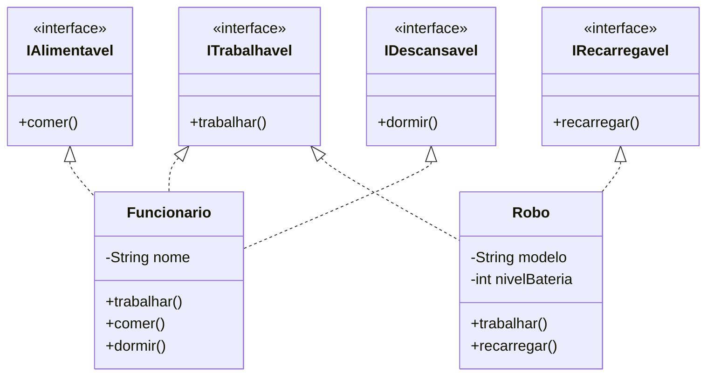

# Exercício 4 — Interface Segregation Principle (ISP)

## 1. Por que `ITrabalhador` viola o ISP

Situação atual:

```java
public interface ITrabalhador {
    void trabalhar();
    void comer();
    void dormir();
}

public class Funcionario implements ITrabalhador { /* implementa os três */ }
public class Robo        implements ITrabalhador { /* e agora? */ }
```

O ISP diz que **nenhum cliente deve ser forçado a depender de métodos que não usa** — e, por
extensão, nenhuma classe deve ser forçada a implementar métodos que não fazem sentido para ela.

`ITrabalhador` é uma **interface gorda**: ela agrupa em um único contrato três capacidades
que não pertencem necessariamente ao mesmo tipo de entidade. Um `Funcionario` de fato
trabalha, come e dorme. Um `Robo` só trabalha — ele não come nem dorme.

Isso força o `Robo` a um dos três caminhos, todos ruins:

```java
public class Robo implements ITrabalhador {

    @Override public void trabalhar() { /* ok, faz sentido */ }

    // Opção A: lançar exceção → viola o LSP (quem recebe ITrabalhador e chama comer() quebra)
    @Override public void comer()  { throw new UnsupportedOperationException("Robô não come"); }

    // Opção B: implementação vazia → mentira silenciosa; o cliente acha que comeu
    @Override public void dormir() { /* não faz nada */ }

    // Opção C: fingir um comportamento equivalente ("carregar bateria" como comer)
    //          → distorce o modelo e confunde quem lê o código
}
```

Problemas concretos:

1. **Métodos sem sentido para o implementador** — `Robo` carrega no seu contrato público
   duas operações que ele não sabe cumprir.
2. **Violação em cascata do LSP** — se `comer()` lança `UnsupportedOperationException`, o
   `Robo` deixa de ser substituível onde se espera um `ITrabalhador`, e o código cliente
   precisa de `instanceof` para se proteger.
3. **Acoplamento desnecessário** — um cliente que só precisa mandar alguém trabalhar (uma
   `LinhaDeProducao`, por exemplo) fica dependendo de uma interface que também declara
   `comer()` e `dormir()`. Se amanhã `comer()` mudar de assinatura, esse cliente recompila
   sem motivo.
4. **Interface instável** — qualquer nova capacidade humana (`tirarFerias()`, `receberSalario()`)
   adicionada à interface obriga **todos** os implementadores, inclusive os robôs, a mudar.
5. **Baixa coesão** — "trabalhar" é uma capacidade profissional; "comer" e "dormir" são
   necessidades biológicas. Não há razão para viverem no mesmo contrato.

## 2. Conjunto de interfaces menores proposto

A segregação segue a coesão real das capacidades: cada interface representa **uma** habilidade,
e cada classe declara apenas as habilidades que realmente possui.

| Interface | Método | Quem implementa |
|-----------|--------|-----------------|
| `ITrabalhavel` | `trabalhar()` | `Funcionario`, `Robo` |
| `IAlimentavel` | `comer()` | `Funcionario` |
| `IDescansavel` | `dormir()` | `Funcionario` |
| `IRecarregavel` *(opcional)* | `recarregar()` | `Robo` |

### Diagrama de classes



## 3. Definição das interfaces e das implementações

### Interfaces segregadas

```java
// ITrabalhavel.java
public interface ITrabalhavel {
    void trabalhar();
}

// IAlimentavel.java
public interface IAlimentavel {
    void comer();
}

// IDescansavel.java
public interface IDescansavel {
    void dormir();
}

// IRecarregavel.java — capacidade específica de máquinas
public interface IRecarregavel {
    void recarregar();
}
```

### Implementações

```java
// Funcionario.java — implementa as três capacidades humanas
public class Funcionario implements ITrabalhavel, IAlimentavel, IDescansavel {

    private final String nome;

    public Funcionario(String nome) {
        this.nome = nome;
    }

    @Override
    public void trabalhar() {
        System.out.println(nome + " está executando suas tarefas.");
    }

    @Override
    public void comer() {
        System.out.println(nome + " saiu para o intervalo de almoço.");
    }

    @Override
    public void dormir() {
        System.out.println(nome + " encerrou o expediente e foi descansar.");
    }
}
```

```java
// Robo.java — implementa apenas o que realmente sabe fazer
public class Robo implements ITrabalhavel, IRecarregavel {

    private final String modelo;
    private int nivelBateria;

    public Robo(String modelo, int nivelBateria) {
        this.modelo = modelo;
        this.nivelBateria = nivelBateria;
    }

    @Override
    public void trabalhar() {
        if (nivelBateria <= 0) {
            throw new IllegalStateException("Bateria esgotada: " + modelo);
        }
        nivelBateria -= 10;
        System.out.println("Robô " + modelo + " executando a rotina automatizada.");
    }

    @Override
    public void recarregar() {
        nivelBateria = 100;
        System.out.println("Robô " + modelo + " recarregado.");
    }

    // Não existe comer() nem dormir() — o contrato nunca prometeu isso.
}
```

### Clientes dependem só do que precisam

```java
// LinhaDeProducao.java — só precisa que alguém trabalhe
public class LinhaDeProducao {

    private final List<ITrabalhavel> equipe;

    public LinhaDeProducao(List<ITrabalhavel> equipe) {
        this.equipe = equipe;
    }

    public void iniciarTurno() {
        for (ITrabalhavel trabalhador : equipe) {
            trabalhador.trabalhar();   // funciona para Funcionario e para Robo
        }
    }
}

// RefeitorioService.java — só precisa de quem come
public class RefeitorioService {

    public void servirAlmoco(List<IAlimentavel> pessoas) {
        for (IAlimentavel pessoa : pessoas) {
            pessoa.comer();            // um Robo nem chega a ser passado aqui: não compila
        }
    }
}
```

```java
// Main.java
public class Main {
    public static void main(String[] args) {
        Funcionario ana  = new Funcionario("Ana");
        Funcionario caio = new Funcionario("Caio");
        Robo r2 = new Robo("R2-Soldador", 100);

        new LinhaDeProducao(List.of(ana, caio, r2)).iniciarTurno();
        new RefeitorioService().servirAlmoco(List.of(ana, caio));   // r2 fica de fora, corretamente

        r2.recarregar();
    }
}
```

## 4. Ganhos obtidos

- **Nenhuma implementação vazia ou que lança exceção** — `Robo` não é mais obrigado a fingir
  que come.
- **O compilador vira aliado**: passar um `Robo` para o refeitório não compila, em vez de
  falhar em produção.
- **Clientes desacoplados**: `LinhaDeProducao` só conhece `ITrabalhavel`; mudanças em
  `IAlimentavel` não a afetam.
- **Extensibilidade**: um `Estagiario` que trabalha e come mas não dorme na empresa
  implementa só `ITrabalhavel` e `IAlimentavel`; um `Drone` implementa `ITrabalhavel` e
  `IRecarregavel`. Nenhuma interface existente precisa mudar.
- **ISP reforça o LSP**: como cada interface promete só o que o implementador cumpre, a
  substituição passa a ser sempre segura.

> **Se um tipo precisar do conjunto completo**, ainda é possível criar uma interface
> composta — `public interface ITrabalhadorHumano extends ITrabalhavel, IAlimentavel, IDescansavel {}` —
> por conveniência. O importante é que a composição seja **opcional**, e que os clientes
> continuem podendo depender apenas da fatia que usam.
