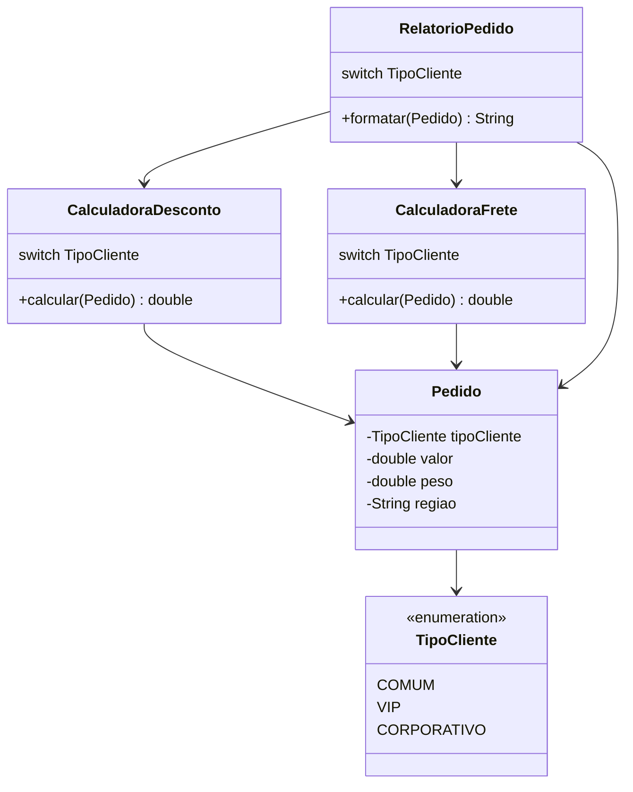
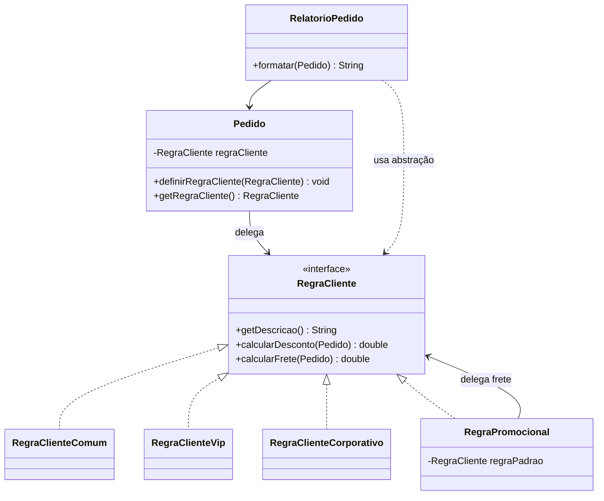

# Atividade 12 — Strategy

## Exercício 1 — Aplicações

### 1. Frete de loja virtual

**Faz sentido usar Strategy.** Sedex, PAC e retirada formam uma família de algoritmos de cálculo de frete que o checkout pode escolher sem conhecer seus detalhes. Uma modalidade nova vira outra estratégia, portanto o `Checkout` permanece fechado para alteração e aberto para extensão.

### 2. Formas de pagamento

**Faz sentido usar Strategy.** Pix, cartão e boleto são escolhidos em runtime pelo cliente e cada um executa um fluxo de pagamento diferente. Uma interface como `ProcessadorPagamento` permite trocar a implementação selecionada sem uma cadeia de `if` no fechamento da compra.

### 3. Fórmulas de dano no jogo

**Faz sentido usar Strategy.** As fórmulas bruto, crítico e à distância são algoritmos intercambiáveis para a mesma operação de calcular dano, enquanto a lógica de batalha continua a mesma. O jogador pode definir ou trocar a estratégia durante a partida sem criar uma subclasse de combate para cada fórmula.

### 4. Relatório PDF único e imutável

**Não faz sentido usar Strategy.** O requisito declara que há um algoritmo único, estável e sem chance de troca, portanto não existe uma família de comportamentos a encapsular. Criar interface e classe concreta nesse caso só adicionaria indireção e overengineering.

### 5. Ponto com soma de coordenadas

**Não faz sentido usar Strategy.** `Ponto` é um objeto de dados simples com uma única operação estável; não há escolha de algoritmo em runtime. O padrão seria justificável apenas se surgissem, por exemplo, formas alternativas e selecionáveis de calcular distância ou transformar coordenadas.

## Exercício 2 — Análise do anti-pattern original

### 1. Decisões por `TipoCliente`

O mesmo `switch (pedido.getTipoCliente())` aparece em **três classes**: `CalculadoraDesconto`, `CalculadoraFrete` e `RelatorioPedido`. Elas repetem os casos `COMUM`, `VIP` e `CORPORATIVO`, embora cada uma use o resultado para uma regra diferente.

Isso indica comportamento de cliente espalhado em vez de encapsulado. A inclusão de um tipo novo exige alterações coordenadas em vários pontos, contrariando o princípio aberto/fechado e criando risco de uma regra ficar diferente das demais.

### 2. Inclusão de `PARCEIRO`

No código original, seria necessário alterar obrigatoriamente:

- `TipoCliente.java`, adicionando `PARCEIRO` ao `enum`;
- `CalculadoraDesconto.java`, com o percentual ou fórmula de desconto;
- `CalculadoraFrete.java`, com a base de frete;
- `RelatorioPedido.java`, com a etiqueta/formatação do novo cliente.

`Main.java` também seria tocada para demonstrar ou testar o novo caso. `Pedido.java` não precisaria mudar, mas continuaria carregando o `enum` que força todas as outras classes a conhecerem cada tipo.

### 3. Dificuldade de teste isolado

Uma regra não é um objeto independente: para testar desconto, frete ou etiqueta, é preciso criar um `Pedido` com um valor do `enum` e depender da condicional da classe inteira. Como `RelatorioPedido` instancia as calculadoras concretas dentro de `formatar`, o teste não consegue fornecer uma regra controlada nem verificar uma regra nova sem modificar produção.

As condicionais concentram vários cenários em cada método, então os testes precisam percorrer todos os ramos de todos os `switches`. Também é fácil testar o desconto de um tipo e deixar o respectivo frete ou rótulo sem cobertura, pois as regras relacionadas vivem em arquivos separados.

### 4. Diagramas de classes

#### Antes



#### Depois



### 5. Refatoração aplicada

Os papéis da solução são:

- **Strategy — `RegraCliente`:** contrato único para obter a descrição, calcular desconto e calcular frete.
- **Concrete Strategies — `RegraClienteComum`, `RegraClienteVip` e `RegraClienteCorporativo`:** preservam as regras do exemplo original. `RegraClienteBase` é um detalhe compartilhado que evita repetir a parcela de peso e região do frete.
- **Strategy adicional — `RegraPromocional`:** calcula um percentual promocional e delega o frete para uma regra padrão recebida no construtor.
- **Context — `Pedido`:** mantém os dados do pedido e a referência a uma `RegraCliente`; `definirRegraCliente` troca o comportamento sem alterar o pedido.
- **Cliente — `RelatorioPedido`:** obtém a estratégia por `Pedido.getRegraCliente()` usando somente o tipo `RegraCliente`. Não conhece `COMUM`, `VIP`, `CORPORATIVO`, `TipoCliente` nem instancia regras concretas.

Essa divisão deixa cada regra testável de modo direto e separa os dados do pedido das políticas que variam. Uma futura `RegraClienteParceiro` implementaria `RegraCliente`; não exigiria modificação em `Pedido` ou `RelatorioPedido`.

### 6. Troca em runtime

O mesmo pedido VIP recebe temporariamente uma promoção de 30% e depois volta à estratégia original:

```java
RegraCliente regraVip = new RegraClienteVip();
Pedido pedido = new Pedido(200.0, 2.0, "sul", regraVip);

pedido.definirRegraCliente(new RegraPromocional(regraVip, 0.30));
// desconto 60.00, frete 18.00, total 158.00

pedido.definirRegraCliente(regraVip);
// desconto 20.00, frete 18.00, total 198.00
```

O contexto muda apenas a referência para a interface. A classe de relatório continua igual porque consulta a estratégia que estiver ativa no momento.

## Código e execução

O código refatorado está em `src/strategy`, e o teste está em `test/strategy/StrategyTest.java`.

```bash
javac -encoding UTF-8 -d out src/strategy/*.java test/strategy/*.java
java -ea -cp out strategy.StrategyTest
java -cp out strategy.Main
```

A execução da `Main` está registrada em [`saida-execucao.txt`](saida-execucao.txt). O teste cobre as três estratégias padrão, o adicional da região norte, a promoção temporária, o retorno à regra VIP e uma implementação anônima de `RegraCliente`, comprovando que o relatório depende da abstração.
