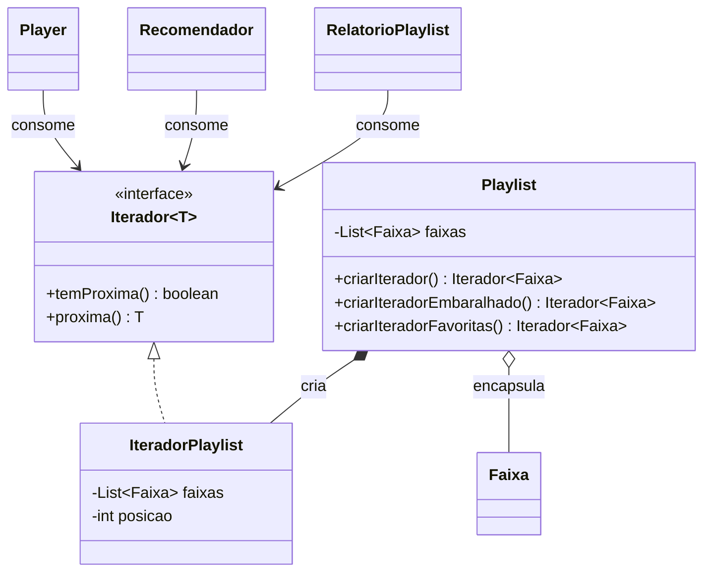

# Atividade 13 — Iterator

## Exercício 1 — Aplicações

### 1. Playlist com ordens diferentes

**Faz sentido usar Iterator.** A playlist precisa oferecer travessias sequencial, embaralhada e somente de favoritas sem expor se guarda as faixas em uma lista, array ou outra estrutura. Cada modo pode entregar um iterador próprio, e o player só conhece as operações de avançar.

### 2. Explorador de arquivos

**Faz sentido usar Iterator.** A navegação por pastas e arquivos tem uma estrutura interna em árvore que a interface não deve revelar. Um iterador pode encapsular uma travessia em profundidade, em largura ou filtrada, mantendo os clientes independentes dos nós e das ligações.

### 3. Arquivo gigante em streaming

**Faz sentido usar Iterator.** Entregar um registro por vez é exatamente a ideia de uma travessia incremental: o cursor guarda a posição atual e não exige carregar todo o arquivo na memória. O consumidor chama `temProxima()` e `proxima()` até o stream acabar, sem conhecer buffer, página ou formato físico.

### 4. Array fixo percorrido internamente

**Não faz sentido usar Iterator.** Há uma única travessia simples, feita dentro da própria classe que já conhece o array, sem necessidade de esconder estrutura ou variar a ordem. Uma interface e um objeto iterador só aumentariam o código sem trazer flexibilidade útil.

### 5. Linhas de `ResultSet`

**Faz sentido usar Iterator.** As linhas devem ser entregues uma por vez enquanto o cursor de banco permanece encapsulado. A interface de iteração evita que o cliente precise controlar posições, páginas ou detalhes da tabela para consumir o resultado.

## Exercício 2 — Análise do anti-pattern original

### 1. Exposição da lista interna

`Playlist.getFaixas()` devolve a própria `ArrayList`, e não uma cópia ou uma visão protegida. Assim, qualquer cliente pode adicionar, remover, limpar, ordenar ou embaralhar faixas, quebrando os invariantes da playlist sem passar por uma operação dela.

`Player`, `Recomendador` e `RelatorioPlaylist` passam a depender de `List<Faixa>` e de operações de lista como `size()` e `get(i)`; a `Main` também usa a lista para imprimir a ordem. A coleção deixa de ser uma implementação privada de `Playlist` e vira parte da API pública por acidente.

### 2. Por que a ordem original mudou

`Player.tocarEmbaralhado` recebe uma referência para a lista interna por meio de `getFaixas()`. Em seguida, `Collections.shuffle(faixas)` reorganiza essa mesma lista **in place**, então o objeto `Playlist` fica definitivamente em uma ordem diferente depois da reprodução.

Na versão refatorada, o embaralhamento acontece sobre uma cópia temporária criada dentro de `Playlist`. Por isso, a travessia aleatória não tem permissão para modificar a sequência de inserção da coleção.

### 3. Travessias duplicadas por índice

Os três clientes — `Player`, `Recomendador` e `RelatorioPlaylist` — repetem a travessia com `size()` e `get(i)`. Se `Playlist` trocar `ArrayList` por array, lista ligada ou páginas remotas, esses **três pontos** precisam ser reescritos; `Main` e qualquer outro consumidor de `getFaixas()` também ficam acoplados e podem quebrar.

Além do custo da alteração, cada laço tende a evoluir de um jeito: um pode pular um elemento, outro pode tratar páginas vazias de forma diferente e outro pode continuar dependendo de índice. O Iterator centraliza o protocolo de avanço e torna a estrutura substituível.

### 4. Diagramas de classes

#### Antes

```mermaid
classDiagram
    class Faixa {
        -String titulo
        -boolean favorita
    }
    class Playlist {
        -List~Faixa~ faixas
        +adicionar(Faixa) void
        +getFaixas() List~Faixa~
    }
    class Player {
        +tocarTudo(Playlist) void
        +tocarEmbaralhado(Playlist) void
    }
    class Recomendador {
        +sugerirFavoritas(Playlist) void
    }
    class RelatorioPlaylist {
        +resumo(Playlist) void
    }
    Playlist o-- Faixa
    Player --> Playlist
    Recomendador --> Playlist
    RelatorioPlaylist --> Playlist
    Player ..> "List<Faixa> por índice"
    Recomendador ..> "List<Faixa> por índice"
    RelatorioPlaylist ..> "List<Faixa> por índice"
```

#### Depois



### 5. Refatoração aplicada

Os papéis da solução são:

- **Iterator — `Iterador<T>`:** interface com `temProxima()` e `proxima()`, o único protocolo que os clientes precisam conhecer.
- **Concrete Iterator — `IteradorPlaylist`:** guarda a posição atual e uma cópia imutável da sequência recebida. Cada instância tem o próprio cursor e lança `NoSuchElementException` quando não há próxima faixa.
- **Aggregate — `Playlist`:** mantém a lista privada, adiciona faixas e cria os iteradores. Não possui `getFaixas()`, portanto não entrega a estrutura mutável a ninguém.
- **Clientes — `Player`, `Recomendador` e `RelatorioPlaylist`:** percorrem apenas `Iterador<Faixa>`. O player reutiliza um único laço privado para os modos normal e embaralhado.

O Aggregate cria cópias temporárias para os modos especializados: uma cópia embaralhada para `criarIteradorEmbaralhado()` e outra filtrada para `criarIteradorFavoritas()`. A lista original nunca sai de `Playlist`, por isso não pode ser reorganizada por um cliente.

### 6. Novas formas de travessia

Uma nova travessia é adicionada como mais um método de criação no Aggregate — por exemplo, `criarIteradorPorArtista(String artista)` — ou como outro iterador concreto quando a regra for mais sofisticada. Esse código fica junto da coleção, onde a estrutura interna é conhecida e pode mudar sem afetar os clientes.

`Player`, `Recomendador` e `RelatorioPlaylist` continuam com o mesmo protocolo `while (iterador.temProxima())`, sem laço por índice e sem receber `List<Faixa>`. A nova política escolhe quais faixas e qual ordem serão entregues; os consumidores continuam apenas avançando pelo resultado.

## Código e execução

O código refatorado está em `src/iterator`, e o teste está em `test/iterator/IteratorTest.java`.

```bash
javac -encoding UTF-8 -d out src/iterator/*.java test/iterator/*.java
java -ea -cp out iterator.IteratorTest
java -cp out iterator.Main
```

A saída executada está em [`saida-execucao.txt`](saida-execucao.txt). O embaralhamento é aleatório e pode, por coincidência, produzir a mesma ordem mostrada nessa captura; o teste verifica que todas as faixas aparecem uma vez e que a travessia sequencial posterior continua `A, B, C`.
